===============================
Tutorial
===============================
A brief guide to help you use and understand version 1.

Once you have completed all applicable steps in Quick Start run the application and wait for it to open. The main window will pop up and look like the following:
Follow the steps in :ref:`Quick Start<QuickStart>` to install and run SBCoyote. When the application starts the first thing you will see is the main window below.
    
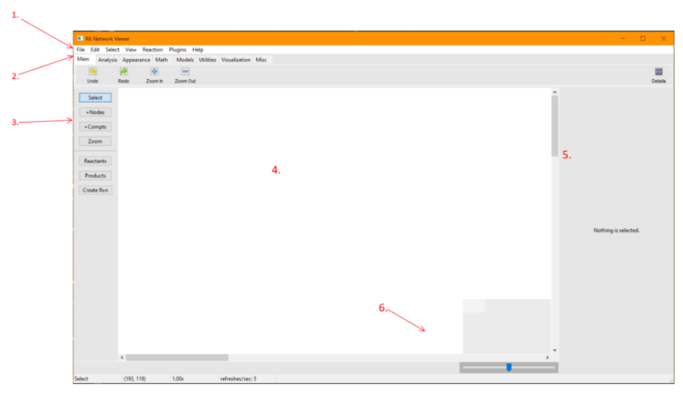

*(Figure 1)*

--------------------
1. Navigation Bar
--------------------
Here you will find all of the necessary utilities and information to use this application. 

**- File**: commands to load or save your canvas, export your work, edit some settings, or exit the application. The application will save files to and load files from the directory in which your app is found.

**- Edit**: basic commands such as copy, paste, undo and redo, along with their keyboard shortcuts. 

**- Select**: shortcuts for selecting parts of the canvas such as all of the nodes.

**- Reaction**: provides quick options to generate your reactions. These allow users to select multiple nodes and mark them all as reactants or products rather than going one by one using the creating panel (explained below). 

**- Plugins**: additional features for creating, visualizing, or analyzing your reactions. A wide selection of plugins are automatically installed with SBCoyote. Any additional plugins you install will appear in this menu as well. The "Applications" section of this tutorial explains how to use SBCoyote's default plugins in detail.

**- Help**: view and edit GUI settings. See "Additional Options" section below.

----------------------
2. Applications Menu
----------------------

A lot of the functionalities found here are also in the Navigation Bar. However, they are organized according to their different uses, allowing you to access them in a more structured way.

**- Main**: We find Undo, Redo, Zoom in, and Zoom out.

**- Analysis**: We find Structural analysis, a function used is to calculate and visualize the stoichiometry matrix and conserved moieties for the network. When the user clicks on the “Compute Conservation Laws” button, the plugin will derive the stoichiometry matrix for the current network on canvas. It also computes any conserved moieties for the network. By selecting the moieties in the plugin, it can highlight the nodes on the network by changing their colors according to the user’s preference. Finally, unhighlighting the nodes is also possible by clicking the “Clear” button.

**- Appearance**: We have Arrow Designer. This allows you to personalize the arrows that appear in the reactions. A window will pop up where you will be able to move the circles to your desired visual. This will be implemented when you click Save. To restore the default arrow you may click arrow designer once again and click Restore Default.

**- Utilities**: Here you will find add reaction, random network, auto layout, and etc. 

- Add Reaction: This allows you to add reactions choosing the type in a quick way. You want to click the Add Reaction utility and simply choose which type of reaction and click the nodes in the order of reactants and products.

- Random Network: This utility lets you create a completely random network with personalized parameters. **NOTE: This will erase your current canvas, not add to it. If you want to save your work you can do so under File in the Navigation Bar.** After You create the random network you will be able to modify it at your own will, including adding and deleting nodes. To customize the parameters:

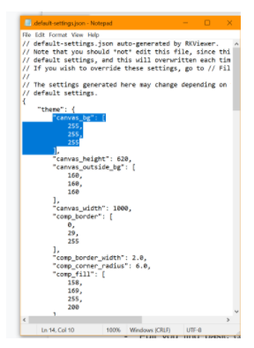

*(Figure 2)*

    + Number of species: The number of nodes that you want featured in your network.

    + Number of reactions: The number of reactions you want to create from the given species.

    + Probabilities: The probability of each type of reaction being featured. These must add to 1.

    + Random Seed: The randomizing seed for the code. This is a setting you won’t need to worry about too much unless you purposely want a lot of different random networks with the same features.
  

- Auto Layout: This utility automatically gives you a “nice” layout of your network. **NOTE**: This has not been implemented for multiple compartments, and doesn’t behave well for complex reactions. This is under work, and will be cleaned by version 2. The parameters:
  
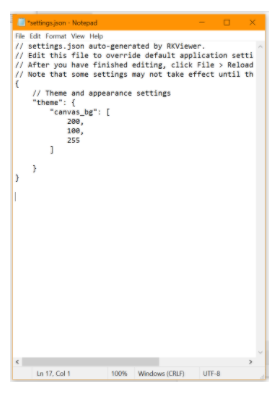

*(Figure 3)*

    + Maximum number of iterations: This will help make the layout more neat. 100-120 is a good default value range. If you have a very high number of nodes then you’re going to want to increase this number. Computationally, it may take a bit longer when this number is increased by a lot.
    
    + K: must be a float (no decimals allowed). This represents (in a way) the distance between nodes. If the number of nodes isn’t very large this number won’t have a big impact. Anything between 60-100 is a reasonable default.
    
    + Scale of the layout: This will modify the extension that the layout will cover. Again, this will not affect the layout too much if it is very large or very small. 500-1000 is a reasonable range.

-------------------
3. Creation Panel
-------------------

This panel allows you to select and create nodes and reactions. This is the basic command center for building your networks.

* The select button allows you to choose nodes that are already in the canvas. 

* Selecting +Nodes will let you click anywhere on the canvas where you want a node to be. These nodes are movable.

* +Compt will allow you to create compartments in which you can add nodes and reactions.

* Reactants will denote the selected nodes as reactants. To create a reaction with multiple reactants, click Select and maintain Ctrl in your keyboard pressed to select multiple.

* Products will denote the selected nodes as products. To create a reaction with multiple products, click Select and maintain Ctrl in your keyboard pressed to select multiple.

* Create Rxn will let you create reactions AFTER you have selected one or more nodes as reactants and one or more nodes as products. You can move the centers of the reaction to look as you desire. 

Note: you will note be able to delete a node that is in a reaction.

-----------
4. Canvas
-----------

This is your visual workspace. Here you will be able to see your created nodes, compartments and reactions. You can move freely through the canvas as well as move nodes and reactions at your will. 

You can right click on a node or on a selection of nodes to delete the selection. You also have an align option: This will let you align a set or nodes in the manners described.

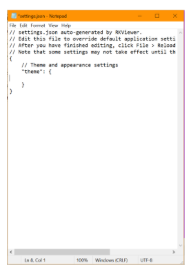

*(Figure 4)*

* Align Left will align nodes vertically to be at the level of the left-most node among all the selected nodes.

* Align Right will align nodes vertically to be at the level of the right-most node among all the selected nodes.

* Align Center will align nodes vertically to be at the level of the horizontal center node among all the selected nodes.

* Align Top will align nodes horizontally to be at the level of the top node among all the selected nodes.

* Align Bottom will align nodes horizontally to be at the level of the bottom node among all the selected nodes.

* Align Middle will align nodes horizontally to be at the level of the vertical center node among all the selected nodes.

* Grid will create a grid view of all the nodes.

* Arrange Horizontally will arrange all nodes so that they are evenly spaced out horizontally along the x position of the center of all the nodes.

* Arrange Vertically will arrange all nodes so that they are evenly spaced out vertically along the y position of the center of all the nodes.

-----------------------
5. Information Panel
-----------------------

This is key to personalizing your nodes and reactions. Through this panel you will be able to add information to and about your networks. **NOTE**: The information panel will only show when something is selected (nodes, reactions, or compartments).

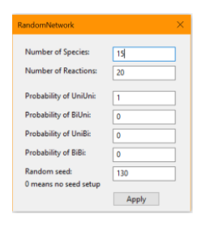

*(Figure 5)*

You will modify independently the reactions selected and the nodes selected.

**- Nodes:** Let’s go over the case where you select a single node. You can adjust settings for multiple nodes at once but some of the features are locked, like identifier, to avoid internal conflict.

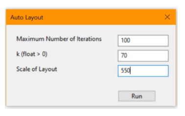

*(Figure 6)*

    * Identifiers: This allows you to change the name of the node in question. E.g. say we want to name it H, we type H into the box.
    
    * Compartment: The compartment, if any, where the node is in.

    * Name: Node name in the annotation.

    * SBO: Node SBO in the annotation, with the expected format as "SBO:0000247".

    * Concentration: Species concentration.

    * Position: This helps you select exactly what canvas coordinate you want the node to be in. Note: the top left corner is the position (0,0).
    
    * Size: This lets you modify the node’s size, it is coherent with the canvas coordinate system. 

    * Node status: Lets you identify a node as floating or border. This comes with a double border, to help you identify this type of node at a glance.
    
    * Lock node: When this box is clicked, it indicates that the node is not to be moved. The program will not let you (or other utilities) drag or move this node. You will see a circle appear at the top left of your node to help you identify locked nodes at a glance.
    
    * Shape: Node shape including rectangle, circle, hexagon, line, triangle, text-only, etc.
        
    * Fill color, fill opacity, border color, border opacity, border width: You can customize these values to your own taste. Note: if you want to change all of the nodes to a specific color you can select all and modify accordingly, you don’t need to go one by one.
    
Here is an example of some of the values being changed and the end result (in contrast to the default values).
    
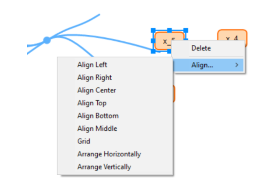

*(Figure 7)*

**- Reactions:** Each case will be very unique, let’s go over a simple scenario.

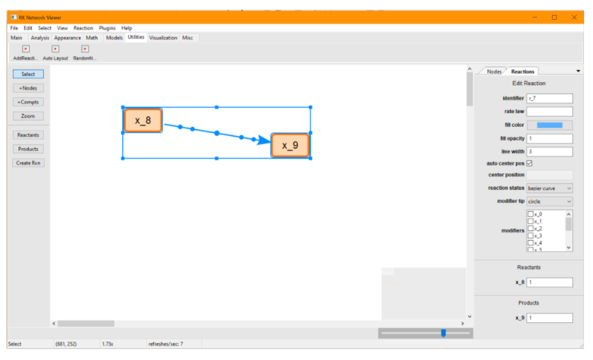

*(Figure 8)*

    * Identifier: the reaction’s name.
    
    * Rate law: you can specify if any applies. I left this empty since it is irrelevant to our simple example.
    
    * Fill color, fill opacity, line width: the color and appearance of the curve of the reaction. I chose red, the default is light blue. You won’t be able to see the change until you have stopped selecting. If you choose an opacity of 0 you will not be able to see the reaction.
    
    * Auto Center position: if checked, it will automatically move the center circle to its default position. If not clicked you may move it manually or assign it a coordinate position.
    
    * Reaction status: Straight line will make your reaction have simple straight lines, whereas bezier curve will calculate and draw the modifiable bezier curve. On the canvas you can move the handles around to get the exact visuals that you like.
    
    * Modifier tip: you can have the modifier’s tip to be circle or flat. 
    
    * Modifiers: this lets you select which of all of the existing nodes in the canvas, in our out of the reaction, to be modifiers of the reaction you are modifying. They will be represented by a fine lilac line with the chosen tip. They will automatically move when the reactions or nodes involved are moved.
    
    * Reactants and products lets you state how many of each you have. It is also a good overview of the reaction when it gets complicated.

-----------------
6. Zoom Control
-----------------

You can visualize the location of your nodes on the little square, and scroll through the bar to zoom in or out.

------------------------------
7. Theme For Developers
------------------------------

Follow the steps below to use SBCoyote in Dark Mode.

    1. Select Help in the Navigation Bar.
    2. Select Default Settings.
    3. Copy the setting(s) that you wish to change.

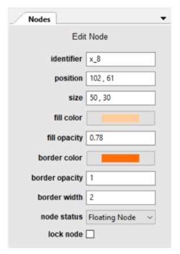

*(Figure 9)*

    4. Click File in the Navigation Bar
    5. Select Edit Settings
    6. Paste the copied settings to change.
    7. Change the values accordingly.

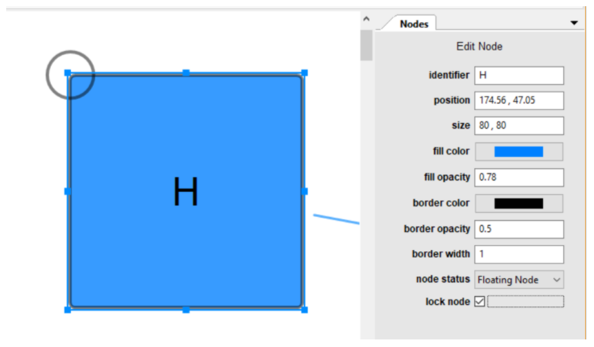

*(Figure 10)*

    8. Close both NotePads and Select File again. (Click save if you haven’t already saved them).
    9. Click Reload Settings or simply exit the application and open it again.

    To restore default settings simple erase all changes made under File -> Edit Settings so that it looks  like the following:

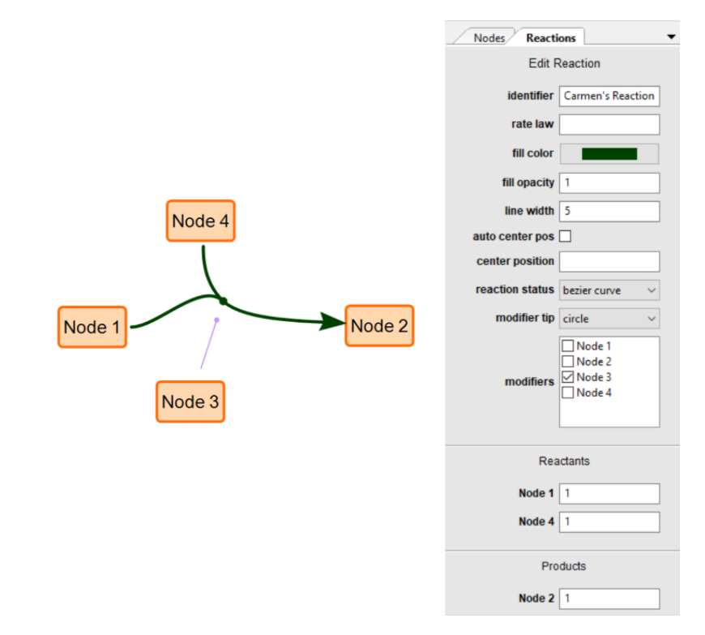

*(Figure 11)*